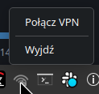

# OpenVPN3 Tray Manager

A lightweight system tray application for managing OpenVPN3 connections on Linux.

Shows an icon in the system tray, lets you connect/disconnect with one click, handles OAuth authorization (opens browser), and sends desktop notifications on connection errors.



## Requirements

- Linux with a desktop supporting **StatusNotifierItem** (KDE Plasma, GNOME with [AppIndicator extension](https://extensions.gnome.org/extension/615/appindicator-support/), XFCE, etc.)
- [`openvpn3`](https://openvpn.net/cloud-docs/owner/connectors/connector-user-guides/openvpn-3-client-for-linux.html) – OpenVPN3 Linux client (3.x)
- A configured VPN profile (`openvpn3 configs-list`)
- Python 3.9+

### Python dependencies

| Package | apt | pip |
|---------|-----|-----|
| `dbus-python` | `python3-dbus` | `dbus-python` |
| `PyGObject` | `python3-gi` | `PyGObject` |
| `Pillow` *(recommended)* | `python3-pil` | `Pillow` |

> Without Pillow, icons are loaded via PyQt6 (fallback). Pillow is faster and doesn't require Qt.

```bash
sudo apt install python3-dbus python3-gi python3-pil
```

## Installation

```bash
git clone https://github.com/magik092/openvpn3-tray-manager.git ~/vpn-manager
cd ~/vpn-manager
bash install.sh
```

The installer will ask for your VPN profile name and preferred language — a one-time setup. The app will then start automatically on every login.

To check your profile name:

```bash
openvpn3 configs-list
```

## Supported languages

Polish · English · Deutsch · Italiano · Français · Čeština · Slovenčina · 中文（简体）

## Changing settings

Just re-run the installer:

```bash
bash ~/vpn-manager/install.sh
```

## Features

- 🟢 **Connected** – green icon, tooltip "VPN: Connected ✓"
- 🟠 **Connecting** – orange blinking icon
- 🔴 **Error** – red blinking icon + desktop notification
- 🔐 **OAuth** – menu button opens authorization in browser
- **Restart session** – resets a stuck connection

## File structure

```
vpn-manager/
├── vpn-tray.py        # main script
├── vpn-tray.desktop   # autostart template
├── install.sh         # installer
├── icon_on.png        # icon – connected
├── icon_off.png       # icon – disconnected
└── tray-example.png   # screenshot
```

Configuration (VPN profile name + language) is stored in `~/.config/vpn-manager/config`.

## License

MIT
